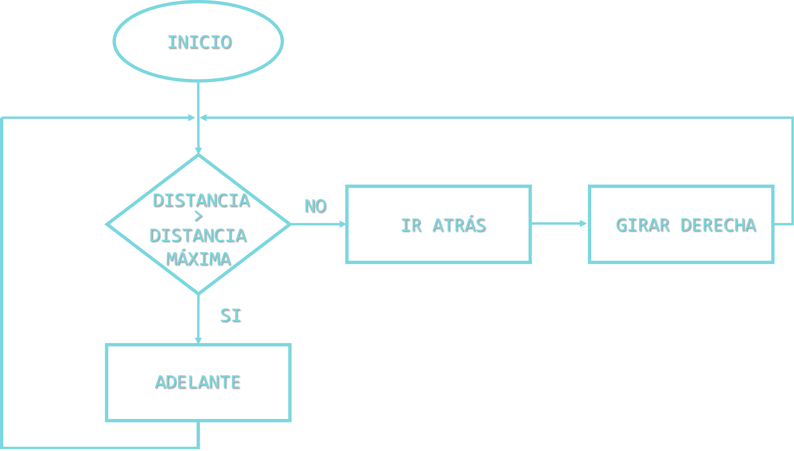

# Vehículo Inteligente

Este reposotorio contiene el código fuente de un robot basado en Arduino para la resolución de laberintos a través de un algoritmo tipo bicho.

  

## 🐛 Algoritmo tipo bicho 

  El algoritmo tipo bicho es una aproximación muy sencilla utilizada en el mundo de la robótica para resolver laberintos. Este tipo de algoritmos basa su funcionamiento en el siguiente diagrama de flujo:

  

La implementación del algoritmo tipo bicho se puede ver en el siguiente <a href="https://github.com/susisip/vehiculo_inteligente/blob/main/src/vehiculo_inteligente.ino"> código</a>.
